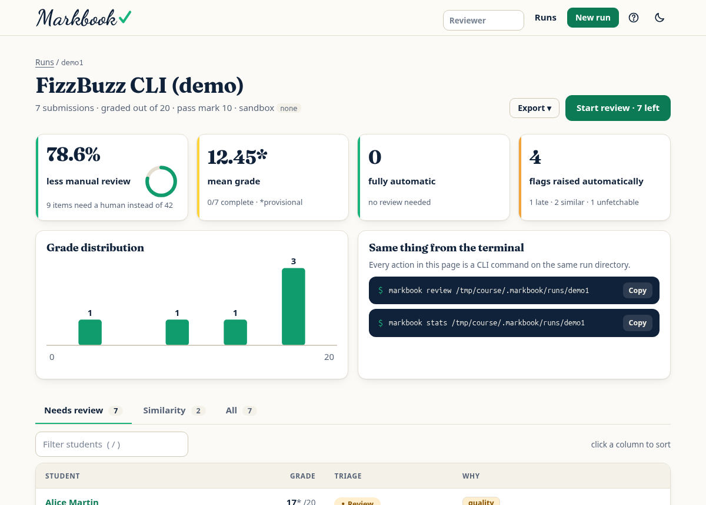
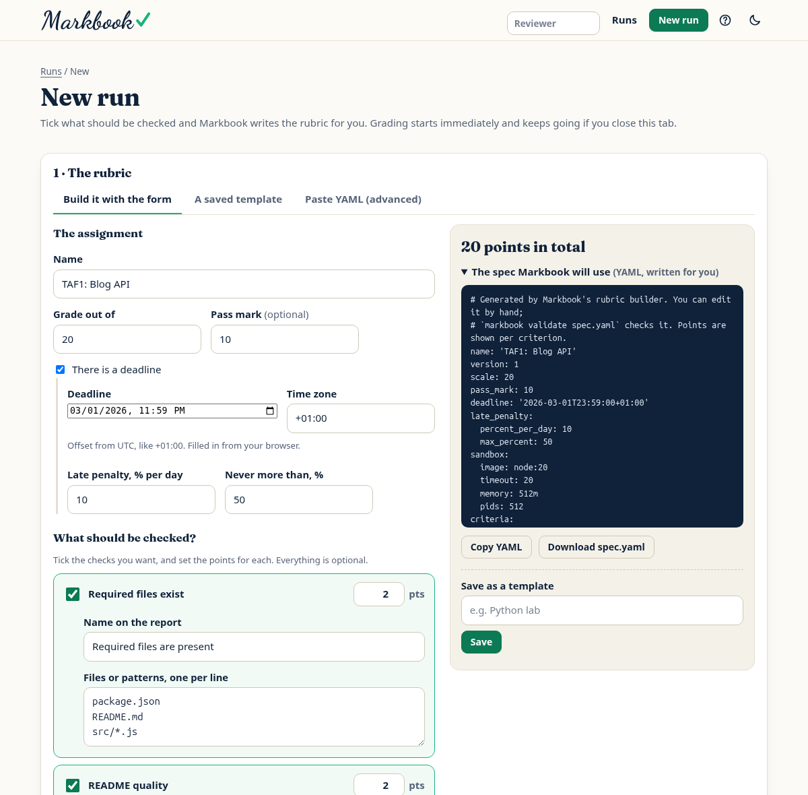
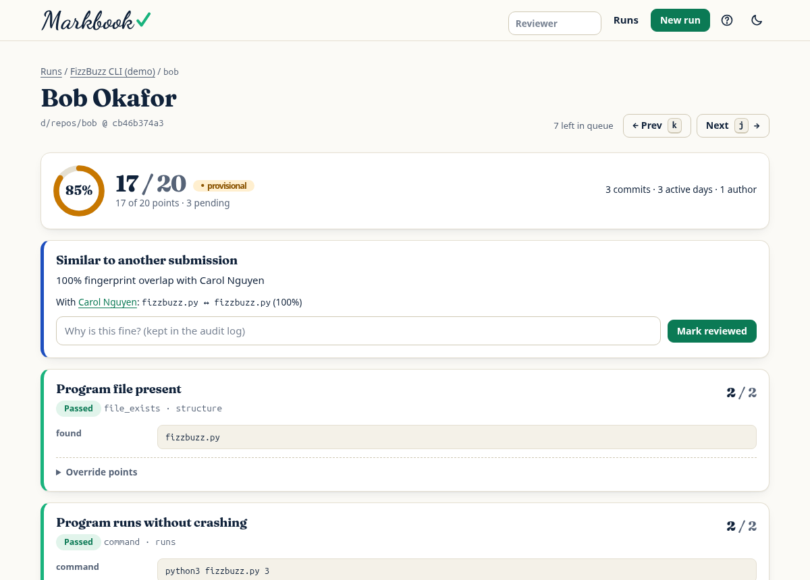
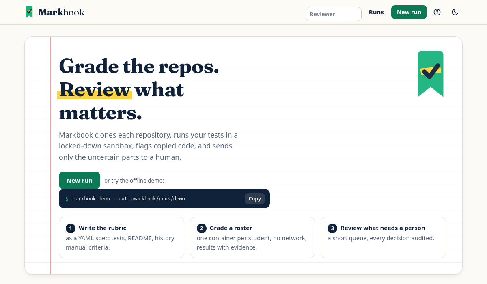

<p align="center">
  <picture>
    <source media="(prefers-color-scheme: dark)" srcset="docs/assets/brand/wordmark-animated-on-dark.svg">
    
  </picture>
</p>

<p align="center"><strong>Grade repositories. Review only what matters.</strong></p>

<p align="center">
  <a href="https://github.com/Dany-hardi/markbook/actions/workflows/ci.yml"></a>
  
  
  
</p>

**Markbook grades Git repositories against a rubric you write as code. Sandboxed, reproducible, and built so a human only looks at what a machine can't decide.**

`markbook` clones each student's repository, runs your tests inside a locked-down container, checks the README and commit history, flags copied code, applies late penalties, and produces reports your LMS can import. Everything the automation is unsure about lands in a short **review queue**; everything else is done.

It is a CLI first. The web UI is a thin layer over the same engine, for people who prefer clicking.

> Markbook was previously called *GitHub Evaluator*. v3 is a ground-up rewrite; the old tkinter and Flask apps are gone.

```console
$ markbook demo
FizzBuzz CLI (demo)  (grades out of 20; * = pending manual review)

  ID      GRADE  TRIAGE  FLAGS
  alice     17*  review  quality
  bob       17*  review  quality, similarity
  carol     17*  review  quality, similarity
  dave    8.08*  review  quality
  erin    13.6*  review  quality, late −20%
  frank      2*  review  quality
  ghost       —  review  invalid_url, fetch_failed

  Review load: 9 item(s) need a human vs 42 if checked by hand → 78.6% less
```

`markbook demo` builds a small cohort of local git repositories (a clean solution, a copied pair with renamed variables, an off-by-one bug, a late submission, a syntax error, an unreachable repo) and grades it offline in about two seconds.

<p align="center">
  <picture>
    <source media="(prefers-color-scheme: dark)" srcset="docs/assets/screenshots/run-dark.png">
    
  </picture>
</p>

<p align="center"><sub>The same run in the web UI: what needs a human, why, and one click to start reviewing. Both themes ship; it follows your system.</sub></p>

<p align="center">
  <picture>
    <source media="(prefers-color-scheme: dark)" srcset="docs/assets/screenshots/builder-dark.png">
    
  </picture>
</p>

<p align="center"><sub><b>No YAML to write.</b> Teachers tick what to check and set the points; the spec is written live beside the form (or answer the questions in <code>markbook init</code> in a terminal).</sub></p>

<table>
  <tr>
    <td width="50%">
      <picture>
        <source media="(prefers-color-scheme: dark)" srcset="docs/assets/screenshots/review-dark.png">
        
      </picture>
    </td>
    <td width="50%">
      <picture>
        <source media="(prefers-color-scheme: dark)" srcset="docs/assets/screenshots/home-dark.png">
        
      </picture>
    </td>
  </tr>
  <tr>
    <td align="center"><sub><b>Review page.</b> Evidence per criterion, a flag with the matching files, every decision audited.</sub></td>
    <td align="center"><sub><b>First run.</b> Three steps, and a copy-paste demo command.</sub></td>
  </tr>
</table>

---

## Contents

- [Install](#install) · [Quick start](#quick-start) · [How grading works](#how-grading-works)
- [Writing a spec](#writing-a-spec) · [Roster](#roster) · [Pinning at the deadline](#pinning-submissions-at-the-deadline)
- [CLI reference](#cli-reference) · [Exit codes](#exit-codes)
- [Reports & LMS integration](#reports--lms-integration) · [Use in CI](#use-in-ci)
- [Review workflow](#review-workflow) · [Measuring the saving](#measuring-the-saving) · [Retrying failures](#retrying-failures) · [Scaling out](#scaling-out-with-a-job-queue) · [AI reviewer assist](#ai-reviewer-assist-optional) · [Web UI](#web-ui)
- [Security model](#security-model) · [Limitations](#limitations)
- [Development](#development) · [More docs](#more-docs)

---

## Install

Requires **Python ≥ 3.10** and **git**. **Docker or Podman** is required to run student code (see [Security model](#security-model)); Podman is selected with `--sandbox podman`.

```bash
pip install .            # CLI only; the only dependency is PyYAML
pip install '.[web]'     # adds the web UI (Flask)
markbook doctor               # checks git, Docker/Podman, optional parts
```

From a clone: `python3 -m venv .venv && . .venv/bin/activate && pip install -e '.[dev]'`.

## Quick start

```bash
markbook demo                                  # see the whole thing work, offline, no Docker needed
markbook init my-course                        # interactive wizard: answer questions, get spec.yaml + roster.csv
# or: markbook init my-course --template python   # a starting file to edit by hand
markbook validate my-course/spec.yaml          # catches every spec mistake up front
markbook grade my-course/spec.yaml --roster my-course/roster.csv --lms canvas
markbook review .markbook/runs/<run-id>             # what still needs a human, with the command to resolve it
```

A single repository works too:

```bash
markbook grade spec.yaml --repo https://github.com/alice/lab1 --id alice
```

Private repositories: export `GITHUB_TOKEN` (read-only is enough). The token reaches `git` through its environment, never the command line, and is only sent to `github.com`.

## How grading works

```
roster ──► git clone ──► history & fingerprints ──► sandbox: build/tests ──► score ──► triage ──► reports
            (pinned SHA)   (read BEFORE student        (one container per      (points,   (auto /     (JSON, CSV,
                            code can run)               submission)             late)      review)     JUnit, MD)
```

1. **Fetch.** One `git clone` per repository (optionally pinned to a `ref`). The graded commit SHA is recorded, so a grade can be reproduced and disputed.
2. **Forensics, before anything runs.** Commit count, active days, authors, size of the largest commit, last-commit time (for lateness). Read before student code executes, because a build step could otherwise rewrite `.git`.
3. **Checks** run in the order of your rubric. Six check types: `file_exists`, `command`, `cases`, `readme`, `git`, `manual`. Criteria can `require` earlier ones: if the build fails, the tests are marked failed without being run.
4. **Scoring.** Each criterion earns a fraction of its points. A late penalty is applied from the last commit time. Grades are scaled to your `scale`.
5. **Triage.** A submission is `auto` (nothing for a human to do) or `review`, with explicit reasons: a `manual` criterion is pending, a grader/sandbox error occurred, the repository could not be fetched, it looks copied, or the score is within a margin of the pass mark.
6. **Reports.** Derived from the raw result plus any human decisions.

The raw result (`run.json`) is never edited. Human decisions go to a separate, append-only `overrides.json`; reports are recomputed from both. Every grade is explainable (each criterion carries its evidence) and every change is attributable.

## Building a rubric without writing YAML

Teachers should not have to learn a file format. Both front ends ask for **choices** (what to check, how many points) and Markbook writes the spec:

- **Terminal:** `markbook init DIR` starts a wizard when run in a terminal (`--wizard` forces it, `--template` skips it). It asks for the name, grade scale, deadline and late penalty, language, then offers each check with a default; pressing Enter everywhere gives a sensible rubric. It re-asks on bad answers, validates the result with `markbook validate`, never overwrites without asking (`--force`), and writes nothing if you press Ctrl-C.
- **Web:** *New run → Build it with the form*. Tick checks, set points; a live panel shows the total and the YAML being written, with *Copy*, *Download spec.yaml* and *Save as a template* (stored in `<runs dir>/../specs`, re-editable from the *A saved template* tab).

The browser and the wizard never send commands: they send choices, and one shared builder (`markbook/specbuilder.py`) turns them into fixed, vetted commands. Extra pip/npm packages are free text, so they are off in the web UI unless the operator starts `markbook serve --allow-prepare`; the wizard always offers them (it is your own terminal). The generated spec goes through the same `load_spec` validation as a hand-written one.

## Writing a spec

A spec is YAML you can still write by hand. `markbook init` writes a starting point; `markbook validate` checks it and lists every problem at once.

```yaml
name: "Lab 3: FizzBuzz"
version: 1
scale: 20                      # grades are reported out of 20
pass_mark: 10                  # enables the "borderline" review flag
deadline: 2026-03-01T23:59:00Z # timezone is mandatory
late_penalty: {percent_per_day: 10, max_percent: 50, grace_minutes: 15}

sandbox:
  image: python:3.12-slim      # student code runs only inside this image
  timeout: 10                  # seconds per command
  memory: 256m
  cpus: 1
  pids: 128
  disk: 64m                    # size of the writable /work area

overlay: tests/                # teacher files copied over the submission (students can't tamper with them)
starter: starter/              # code handed to students; excluded from similarity
similarity: {threshold: 0.6}

criteria:
  - id: builds
    title: Compiles
    points: 4
    check: {type: command, run: "make", expect_exit: 0}

  - id: behaviour
    title: Correct output
    points: 10
    requires: [builds]
    check:
      type: cases
      run: ./fizzbuzz
      cases_file: cases.yaml   # or inline `cases:`
      compare: trim            # trim (default) | tokens | exact

  - id: readme
    title: README
    points: 2
    check: {type: readme, sections: [install, usage], min_words: 40, forbid: ["lorem ipsum"]}

  - id: history
    title: Incremental work
    points: 2
    check: {type: git, min_commits: 3, min_active_days: 2, max_single_commit_share: 0.8}

  - id: design
    title: Code design
    points: 2
    check: {type: manual, guidance: "Naming, decomposition. 0-2."}
```

### Check types

| `type` | Options | Awards |
|---|---|---|
| `file_exists` | `paths`: list of globs (matched against the full path and the file name) | fraction of globs matched |
| `command` | `run`, `expect_exit` (default 0), `stdout_contains`, `stdin`, `timeout` | all or nothing |
| `cases` | `run`, `cases` / `cases_file`, `compare`, `timeout` | fraction of cases passed |
| `junit` | `run`, `report` (default `report.xml`), `min_tests` (default 1), `hidden`, `timeout` | fraction of tests passed (per-test credit) |
| `readme` | `sections` (matched against headings), `min_words`, `forbid` (regexes) | fraction of conditions met |
| `git` | `min_commits`, `min_active_days`, `min_authors`, `max_single_commit_share` | fraction of conditions met |
| `manual` | `guidance` | nothing until a human grades it; always routed to review |

A **case** has `name`, `args`, `stdin`, and any of `stdout`, `stdout_regex`, `exit`. Unless a case sets `exit`, **exit code 0 is required**, so a crashing program can't earn a case by printing nothing. A case with `hidden: true` never reveals its expected output in feedback.

**`junit`: real test suites.** Run your test command so that it writes a JUnit XML report, and points are awarded per passing test. This works with anything that emits JUnit XML: `pytest --junitxml=report.xml`, Maven/Gradle surefire, `ctest --output-junit`, `gotestsum`, `cargo nextest`.

```yaml
- id: tests
  title: Unit tests
  points: 10
  check: {type: junit, run: "python -m pytest -q -p no:cacheprovider --junitxml=report.xml", min_tests: 5, hidden: true}
```

Credit is `passed / (passed + failed)`; skipped tests are reported but not counted. **A run that finds fewer than `min_tests` tests earns nothing**, because "no tests ran" must never look like a clean pass (the same rule as "a crash can never pass"). A report that is missing, malformed, over 1 MiB or that declares a DOCTYPE/ENTITY is a failure with the runner's output as evidence. Any `report.xml` already in the student's repository is deleted before the run, so a committed all-pass report is ignored. `hidden: true` shows failures without test names or messages.

> **Trust limit.** The test runner imports the student's code in the same process, so a determined student can forge the report from inside their own code. `cases` does not have this weakness, because the program is a black box. For high-stakes grading, prefer `cases` with hidden, varied inputs, or run the teacher's tests via `overlay` and treat `junit` as a convenience.

### Dependencies: `prepare`

The sandbox has no network, so an assignment that needs `pytest`, `requests`, a Maven cache or `npm ci` needs its dependencies installed another way. `prepare` does that **once per cohort, with network, using only your commands and files**, and bakes the result into a cached image:

```yaml
sandbox: {image: python:3.12-slim}
prepare:
  files: [requirements.txt]                 # next to the spec; copied into the build
  run: ["pip install --no-cache-dir -r requirements.txt"]
  timeout: 600
```

```console
$ markbook prepare spec.yaml      # optional: build ahead of time
✓ markbook-prepared:32a0b76f8a4e9f22  (built)
$ markbook grade spec.yaml --roster roster.csv     # first run builds if needed; later runs reuse the cache
```

- Student containers then start from that image **exactly as before**: no network, non-root, capabilities dropped, no host mounts. Student code never has network access.
- **Why not install each student's own `requirements.txt`?** `pip install` and `npm install` execute student-controlled build scripts. That would give strangers' code network access from the grading machine: exfiltration, and a route to whatever that machine can reach. So a student's own requirements file is deliberately **not** installed; the dependencies are the ones you chose, which also makes grading repeatable and fair.
- The image is keyed on the base image ID, the commands and the content of every `prepare.files` entry, and rebuilt only when one changes. The report records the image, key, commands and file digests (`assignment.sandbox.prepared`).
- Needs Docker or Podman. With `--sandbox none` nothing can be built, so grading stops with exit code 3 and an explanation. A failing build also stops with exit code 3 (pip's own error is in the message) before any student is graded.
- `prepare` is refused in specs uploaded through the web UI, because it runs commands with network access; use a saved spec (`serve --specs DIR`) or the CLI.
- Prepared images are labelled `markbook=prepared`; remove old ones with `docker image prune --filter label=markbook=prepared -a`.

## Roster

A CSV with a header row. Only a repository column is required; column names are matched case-insensitively with common aliases (`repo`/`url`/`github`, `id`/`login`/`username`, `name`/`student`, `email`, `ref`/`commit`/`branch`).

```csv
id,name,email,repo,ref
alice,Alice Martin,alice@uni.edu,https://github.com/alice/lab3,
bob,Bob Okafor,bob@uni.edu,owner/bob-lab3,a1b2c3d
```

Accepted repo forms: `https://github.com/o/r`, `github.com/o/r`, `o/r`, `git@github.com:o/r.git`, and `.../tree/<branch>/<subdir>` (grades only that subdirectory). The CLI also accepts local paths; the web UI does not. Put the identifier your LMS expects in `id` (see below).

## Pinning submissions at the deadline

Lateness read from commit timestamps is only as honest as the student's clock, and a student can keep pushing after the deadline. `markbook pin` records, per student, the exact commit that existed at the deadline; `grade` then grades *that* commit.

```bash
markbook pin spec.yaml --roster roster.csv --bundle evidence/   # run when the deadline passes
markbook grade spec.yaml --roster roster.pinned.csv
```

- **`--at now`** (default): resolves each repository's current tip with `git ls-remote` (no clone). It records the remote's state at capture time, so commit-timestamp tricks cannot backdate it. A roster `ref` (branch or tag) is resolved the same way; a full SHA is kept as is.
- **`--at deadline`**: retroactive. Clones (blobless) and takes the last commit dated on or before the spec's `deadline`. This **still trusts commit timestamps**, which a student can backdate, so it is a best-effort fallback, not evidence. Needs a `deadline` in the spec.
- **Output:** `roster.pinned.csv` (all original columns, `ref` filled, plus `pinned_at`, UTC) and `pins.json` next to it (per student: repo, sha, mode, captured_at, `verified`, bundle, `error`). `verified` means the SHA was seen as an advertised tip or found in a clone; a given SHA that is not a current tip is not claimed as verified.
- **Failures** (private, missing or empty repo, no commit before the deadline) keep an empty `pinned_at` and an `error` code in `pins.json`; any original `ref` is left untouched, so check `pinned_at`. Everything else is still written and the command exits **5**.
- **`--bundle DIR`** also stores `<id>-<sha12>.bundle` per student (a full clone, so it can be large) and checks it contains the SHA. Restore with `git init r && git -C r fetch ../evidence/alice-<sha12>.bundle refs/markbook/pin`.

`pin` only helps if it runs promptly: with `--at now` the capture time is when you run it, not the deadline. Tokens work as in `grade` (`--token-env`, only sent to `github.com`).

## CLI reference

```
markbook init [DIR] [--wizard | --template python|c] [--force]
markbook validate SPEC
markbook pin SPEC --roster CSV [--out CSV] [--at now|deadline] [--bundle DIR] [--token-env VAR] [--jobs N]
markbook grade SPEC (--roster CSV | --repo URL ...) [options]
markbook review RUN [--all] [--json]
markbook show RUN STUDENT
markbook override RUN STUDENT [-c CRITERION (-p POINTS | --accept-suggestion)] [--waive-late] [--clear similarity|borderline] [-m COMMENT]
markbook retry RUN [--sandbox docker|podman|none] [--jobs N]
markbook prepare SPEC [--sandbox docker|podman] [--force]
markbook enqueue SPEC --roster CSV --queue DIR [--sandbox docker|podman|none]
markbook worker DIR [--jobs N] [--lease-seconds S] [--idle-exit]
markbook queue-status DIR [--json]
markbook collect DIR [--out RUNDIR] [--lms canvas|moodle ...] [--partial]
markbook runs [--dir DIR] [--json]
markbook stats RUN [--idle-minutes N] [--baseline CSV] [--json]
markbook report RUN [--lms canvas|moodle ...] [--include-pending] [--out DIR]
markbook schema
markbook doctor [--clean]
markbook ai-check [--model M] [--suite] [--json] [--max-cost-usd N]
markbook serve [--dir DIR] [--host H] [--port P] [--sandbox docker|podman|none] [--allow-prepare]
markbook demo [--dir DIR] [--out DIR] [--serve]
```

`RUN` is a run directory, or a bare run id under `.markbook/runs/`.

`markbook grade` options:

| Option | Meaning |
|---|---|
| `--roster FILE` / `--repo URL` | Who to grade (`--repo` is repeatable; add `--id`, `--name`, `--ref` for a single repo). |
| `--out DIR` | Output directory (default `.markbook/runs/<run-id>`). |
| `--sandbox docker\|podman\|none` | `docker` (default) or `podman` isolate student code. `none` runs it on this machine; use only inside an environment that is already isolated (CI job, VM, LXD container). |
| `--jobs N` | Submissions graded in parallel (default 4). |
| `--lms canvas\|moodle` | Also write an LMS import CSV (repeatable). |
| `--include-pending` | Write provisional grades for submissions still awaiting manual review. |
| `--token-env VAR` | Env var holding a GitHub token (default `GITHUB_TOKEN`, then `GH_TOKEN`). |
| `--format text\|json` | `json` prints the full report to stdout (progress goes to stderr), for piping into `jq` or another tool. |
| `--ai` / `--ai-model M` | Opt in to [AI suggestions](#ai-reviewer-assist-optional) for criteria marked `ai: true`. Sends code to the Anthropic API. |
| `--fail-on-review` | Exit 4 when anything needs review. |

Press **Ctrl-C** during grading to stop: no new submissions are started, the ones already running finish (bounded by their timeouts) and remove their containers, and the command exits 130 without writing a partial run.

Scripting examples:

```bash
markbook grade spec.yaml --roster roster.csv --format json --quiet | jq '.summary.review_load'
markbook review .markbook/runs/20260302-0900-ab12 --json | jq -r '.[].id'
```

### Exit codes

| Code | Meaning |
|---|---|
| 0 | Success |
| 1 | Error: invalid spec/roster/run, unknown student, bad override |
| 2 | Usage error |
| 3 | Sandbox unavailable (Docker missing or unreachable and `--sandbox docker` requested). Nothing is graded and nothing is written. |
| 4 | Success, but items need review (only with `--fail-on-review`) |
| 5 | `pin` wrote its outputs, but some repositories could not be pinned (see `pins.json`) |

## Reports & LMS integration

`markbook grade` writes to the run directory:

| File | Contents |
|---|---|
| `report.json` | Everything, validated against a published JSON Schema (`markbook schema`). |
| `grades.csv` | One row per student: `id,name,email,repo,commit,status,grade,scale,late,penalty_pct,review,review_reasons` plus `pts_<criterion>` columns. |
| `grades.canvas.csv` / `grades.moodle.csv` | LMS import files (`--lms`). |
| `junit.xml` | One `<testsuite>` per student, one `<testcase>` per criterion, so any CI can display the cohort. |
| `summary.md` | Cohort statistics and the review queue, ready to paste into a ticket. |
| `feedback/<id>.md` | Per-student feedback, safe to send (hidden test details are never included). |
| `run.json`, `overrides.json` | Raw machine result and the audit trail of human decisions. |

**Grades are never released early.** The `grade` column in the CSVs is blank while a submission is `pending_review` or `error`. Pass `--include-pending` to get provisional numbers.

**JSON contract.** `report.json` carries `schema_version`. Consumers should ignore unknown properties; breaking changes bump the version. `markbook schema` prints the schema; the test suite validates real output against it, including output with overrides applied.

**Canvas.** `grades.canvas.csv` follows Canvas's gradebook import layout: `Student, ID, SIS User ID, SIS Login ID, Section, <assignment>` and a `Points Possible` row, matching students on `SIS Login ID`. Put each student's Canvas login in the roster `id` column.

**Moodle.** `grades.moodle.csv` follows the offline grading worksheet layout (`Identifier`, `Full name`, `Email address`, `Grade`, `Maximum grade`, `Feedback comments`…). Put the Moodle *identifier* in the roster `id` column.

> The LMS layouts were written from each platform's documented import format and are covered by format tests, but they have **not** been verified against a live Canvas or Moodle instance. Do a test import into a sandbox course before relying on them for a real cohort. LMS exports vary by version and configuration.

## Use in CI

Grade on every push of a submissions repository, publish the cohort as test results, and fail the job if anything needs a human:

```yaml
# .github/workflows/grade.yml
on: workflow_dispatch
jobs:
  grade:
    runs-on: ubuntu-latest        # already an isolated, throwaway VM
    steps:
      - uses: actions/checkout@v4
      - uses: actions/setup-python@v5
        with: {python-version: "3.12"}
      - run: pip install .
      - run: markbook grade spec.yaml --roster roster.csv --lms canvas --out out --fail-on-review
        env: {GITHUB_TOKEN: "${{ secrets.READ_TOKEN }}"}
      - uses: actions/upload-artifact@v4
        if: always()
        with: {name: grades, path: out/}
```

The GitHub-hosted runner is a disposable VM with Docker, so the default `--sandbox docker` should work as is (this workflow is provided as a starting point and has not been run on GitHub Actions).

## Review workflow

The point of the tool is a short queue.

```console
$ markbook review .markbook/runs/demo1
bob  Bob Okafor  17*
    • criterion quality (3 pts): manual criterion
        markbook override demo1 bob -c quality -p <0-3> -m "…"
    • similarity: 100% fingerprint overlap with Carol Nguyen

$ markbook show demo1 bob                      # criteria, evidence, similar files
$ markbook override demo1 bob -c quality -p 3 -m "Clean decomposition."
$ markbook override demo1 bob --clear similarity -m "Both used the lecture helper."
$ markbook override demo1 erin --waive-late -m "Approved extension."
```

- A decision never edits the raw result; it is appended to `overrides.json` with reviewer, time, and what it replaced.
- `--reviewer NAME` (or `MARKBOOK_REVIEWER`) sets who is recorded; default is the OS user.
- Similarity is a **routing signal, not a verdict**. It never changes a grade, and each flag shows the matching files so a human can verify it.
- "Review load" in the summary is a *modelled* figure: baseline is every criterion of every submission checked by hand; review items are unresolved manual/error criteria plus similarity, borderline and fetch-failure flags. It is a workload estimate, not a measured time saving; see [Measuring the saving](#measuring-the-saving) for how to measure one.

## Measuring the saving

`markbook stats RUN` derives review-effort numbers from the audit log (and, in the web UI, a small view log): decisions per reviewer, active review time (a lower bound; gaps over `--idle-minutes` are breaks), median seconds per decision, items still queued, and the AI-assisted share and accept-unchanged rate. With `--baseline manual.csv` (`submission_id,seconds`, the same submissions graded entirely by hand) it prints the measured comparison next to the modelled review-load figure, labelled with its sample size and with cautions when the sample is small or mismatched. It never extrapolates. Markbook makes no measured time-saving claim; [docs/MEASURING.md](docs/MEASURING.md) is a short protocol for getting a fair one.

## Retrying failures

Fetch failures (a private repo you've since been given access to, a network blip, a corrected ref) and criteria that errored in the sandbox are exactly the review items automation can resolve itself once the cause is fixed:

```console
$ markbook retry .markbook/runs/20260302-0900-ab12
retrying 2 submission(s): ghost, frank
✓ re-graded 2; 1 recovered, 1 still failing
```

Only the failed submissions are re-graded; everything else stays byte-for-byte as it was, and similarity is recomputed across the whole cohort from fingerprints stored with the run. `retry` refuses if the spec's hash has changed since the run (re-grading part of a cohort against a different rubric would make grades incomparable). `markbook runs` lists runs with how many items in each still need review.

## Scaling out with a job queue

For cohorts too big for one machine, grading can be split across several processes or machines through a **queue directory**: plain files on a filesystem all workers can reach (an NFS export, a mounted volume, or just a local directory for several processes). No database, broker or network service.

```bash
markbook enqueue spec.yaml --roster roster.csv --queue /shared/q1 --sandbox docker
markbook worker /shared/q1 --jobs 4          # on each grading machine; add --idle-exit to stop when the queue drains
markbook queue-status /shared/q1             # pending / claimed / done / failed, workers, stale leases
markbook collect /shared/q1 --lms canvas     # when everything is done; same reports as `markbook grade`
```

How it works:

- `enqueue` freezes a copy of the spec (plus the spec's whole directory, only if it uses `overlay`, `starter` or `cases_file`), records its sha256 and a hash of those files in `meta.json`, and writes one job file per submission into `pending/`. Job files hold roster fields only. **Tokens are never written to the queue**: each worker uses its own `GITHUB_TOKEN`/`--token-env`.
- A worker claims a job with an atomic `os.rename` from `pending/` into `claimed/<worker>/`; whoever wins the rename owns it. It grades with the same `grade_submission` as `markbook grade`, publishes `done/<id>.json` (record plus similarity fingerprints) and drops its claim. It refuses to start if the frozen spec or its files no longer match the recorded hashes.
- While it works, a worker refreshes a heartbeat. If a worker dies (crash, `kill -9`, lost machine), any other worker returns its claimed jobs to `pending/` once the lease (`--lease-seconds`, default 300, plus a margin of 25% capped at 30 s) has expired. A job whose workers are lost 3 times becomes an error record (`worker_lost`) instead of looping forever.
- Results are **exactly once**: a result is published with a hard link that fails if one exists, so a late result from a worker presumed dead is discarded and never overwrites or duplicates a finished one.
- A job that raises becomes a normal `status: error` submission, never a lost job. A job file that cannot be read is moved to `failed/` and shows up as `not_graded` at collect time.
- `SIGINT`/`SIGTERM` makes a worker stop claiming; it finishes the job(s) in hand (bounded by their timeouts; containers are removed as usual) and exits 0. For queues created with `--sandbox docker`, a worker checks Docker and pulls the image once at start-up (exit 3 if Docker is unusable).
- `collect` builds the run with the same `assemble_run` in roster order and saves it like `grade` does (run.json, fingerprints, reports, `inputs`). It refuses while jobs are unfinished; `--partial` collects anyway and marks every missing submission as an error with code `not_graded` (never a silent zero). The test suite checks that the demo cohort graded locally and through the queue (3 competing worker processes) gives identical scores, statuses, triage and similarity.

Security and honesty:

- **The queue directory is a trust boundary.** Anyone who can write to it can make workers clone and run arbitrary repository URLs (through the sandbox, or on the bare host with `--sandbox none`) and can forge results. Keep it private to the grading team, and only run workers on machines you trust. Do not put it on a share that students or other courses can write to.
- **Verified here:** several worker *processes* on one Linux machine, including competing claims, `kill -9` recovery, graceful `SIGTERM` and equivalence with local grading. **Multi-machine operation was not verified.** Rename is atomic on local filesystems, and is expected to be on NFS for renames inside one export, but NFS retransmits and exotic or eventually consistent shared filesystems (some FUSE and object-store mounts) are untested; do not rely on them.
- **Clock skew matters.** Liveness is judged from heartbeat file modification times against each machine's clock. Keep clocks in sync (NTP), and keep `--lease-seconds` comfortably above any expected skew plus the heartbeat interval (lease/4). Too short a lease only wastes work (the duplicate result is discarded); it cannot corrupt a run.
- POSIX only, like the rest of Markbook. There is no authentication or encryption: that is the filesystem's job.

## AI reviewer assist (optional)

For `manual` criteria you can ask Claude for an *advisory* score and rationale, to speed up the human, never to replace them.

```yaml
- id: design
  points: 5
  check: {type: manual, guidance: "Decomposition, naming, error handling. 0-5.", ai: true}
```

```bash
pip install 'markbook[ai]'         # and set ANTHROPIC_API_KEY (or run `ant auth login`)
markbook grade spec.yaml --roster roster.csv --ai
markbook review RUN                # shows "AI suggests 4/5 (medium confidence; advisory)"
markbook show RUN alice            # the rationale, concerns, and which files it did not see
markbook override RUN alice -c design --accept-suggestion -m "Agree."
```

How it is constrained:

- **Two opt-ins.** The spec must mark the criterion `ai: true` *and* you must pass `--ai`. Without both, nothing is sent. `--ai` prints which criteria and how many submissions' source code will go to the Anthropic API; check that against your institution's data policy first.
- **Suggestion only.** The criterion stays pending, the score is unchanged, the submission stays in the review queue, and the suggestion does **not** count toward the "less manual review" figure. A human accepts, edits or ignores it; the audit log records the AI's suggested points next to the human's decision (including when they disagree).
- **Untrusted input.** Student code goes to the model as delimited *data*; delimiter break-outs are neutralised; the system prompt tells the model to ignore instructions inside the submission and to report attempts under `concerns`; output is constrained to a JSON schema and clamped to `[0, max]`.
- **Honest about coverage.** Whole files only, up to a budget (60k characters). Anything left out is listed, and confidence is capped at `medium` when code was not seen.
- **Fails safe.** No SDK, no credentials, a refusal, an API error: the criterion simply has no suggestion. Credentials are checked before any repository is cloned.
- Default model `claude-opus-5-5` (`--ai-model` to change).

> **Verification status.** The request format was checked against the real Anthropic SDK (1.11) by capturing the exact JSON it puts on the wire, and all behaviour is tested with a fake client. It has **not** been run against the live API: there was no API key in the development environment. To check it with your own key, run `markbook ai-check` (one tiny call) and `markbook ai-check --suite` (a few cents of synthetic fixtures, including prompt-injection and delimiter break-out cases); see [docs/AI-CHECK.md](docs/AI-CHECK.md). As of this commit neither has been run live.

## Web UI

```bash
pip install '.[web]'
markbook serve                 # http://127.0.0.1:5000, runs stored in .markbook/runs
markbook demo --serve          # demo cohort, then open the UI
```

Same engine, same run directories: a run started in the browser can be reviewed from the CLI and vice versa.

- **Home:** run cards with how much of each run is resolved, a filter, and a notebook-style welcome on first use. A short intro animation plays once per browser session on the home page; click or press any key to skip it, and it never plays for people who prefer reduced motion.
- **Run page:** headline numbers, grade distribution, review queue first, a sortable and filterable table, exports, and the equivalent `markbook` command for each view with a copy button.
- **Review page:** one card per criterion with the evidence; type points and a comment. Resolving a submission jumps to the next one in the queue. `j`/`k` move between submissions, `/` filters, `?` lists the shortcuts.
- **Light and dark themes** follow your system and can be switched with the toggle; the choice is remembered. Chart colours meet the 3:1 non-text contrast guideline and text meets WCAG AA in both themes (a test enforces it).
- Server-rendered, no CDN or external requests (the typeface is bundled), strict Content-Security-Policy, keyboard accessible.
- The UI has **no authentication**. It binds to `127.0.0.1` by default; `markbook serve --host 0.0.0.0` prints a warning. Put it behind an authenticating reverse proxy if you expose it.
- Uploaded specs must be self-contained: `overlay`/`starter` paths outside the upload are refused. For specs that use `overlay`, `starter` or `cases_file`, put them in a directory and start the UI with `markbook serve --specs DIR`; they then appear in a dropdown on the *New run* page (operator-provided, so trusted).
- Web rosters accept `https://` repositories only, never local paths.

## Security model

Student code is untrusted. Treat the grader as a system that runs arbitrary code from strangers.

**Docker sandbox (default).** One throwaway container per submission, shared by all of its commands:

| Control | Setting |
|---|---|
| Network | `--network none` |
| Privileges | non-root (your uid), `--cap-drop ALL`, `no-new-privileges` |
| Resources | `--memory` (swap = memory), `--cpus`, `--pids-limit`, per-command `timeout -s KILL` inside the container |
| Filesystem | no host paths mounted; sources streamed in as a tar into a **size-capped tmpfs** (`disk`), root FS not writable by the user |
| Output | at most 64 KiB kept per stream |
| Cleanup | container removed after the submission, including on errors |

**Podman (`--sandbox podman`)** applies the same controls (the same flags are asserted for both runtimes in a table-driven test). It additionally *reads back* the memory/CPU/PID limits from inside the container and refuses to grade if rootless Podman did not enforce them (cgroup v2 controllers not delegated to your user), instead of running unlimited. **Podman support is verified only by the `podman` CI job; it has not been run on the maintainer's machines.** LXD is not implemented: it uses system containers and `lxc exec`, not an OCI-compatible CLI, so it would be a different design rather than another binary name.

**No silent fallback.** If you ask for Docker or Podman and it isn't usable, grading stops with exit code 3 and an explanation. `--sandbox none` exists for environments that are *already* isolated, prints a warning, and only applies `ulimit` CPU-time and file-size limits plus a scrubbed environment. It is **not** a sandbox.

**Network for dependencies.** The only step that ever has network access is `prepare`, which runs your commands (never a student's) once per cohort. Student containers always run with `--network none`. See [Dependencies: `prepare`](#dependencies-prepare).

**Other protections:**
- Git history, similarity fingerprints and the README are read from the clone *before* any student code runs.
- The sandbox image is pulled once, up front, not by N parallel workers mid-grading. `markbook doctor --clean` removes containers orphaned by a killed run.
- CSV exports neutralise spreadsheet formula injection: a student named `=HYPERLINK(...)` is written as text, so opening the export in Excel cannot run it. Identifiers and grades are untouched.
- `overrides.json` is written under a file lock, so the CLI and the web UI can record decisions at the same time without losing any.
- The container receives a copy without `.git`; symlinks are removed from the copy; README/file checks refuse paths that resolve outside the submission.
- Teacher files (`overlay`) are copied over the submission, so students cannot replace your tests.
- Credentials travel in git's environment, only to `github.com`; clone uses `core.hooksPath=/dev/null`, refuses `ext::`/`file:` transports for remote URLs, and rejects URLs or refs starting with `-`.
- The web UI sends a strict CSP, `X-Frame-Options: DENY` and `nosniff`, rejects cross-origin POSTs, escapes all evidence, validates run ids, and caps uploads at 2 MB.

## Limitations

Known and deliberate; please don't discover them in production:

- **Podman is CI-verified only**, rootless Podman needs cgroup v2 with the `memory`, `cpu` and `pids` controllers delegated to your user (otherwise grading stops with a message), and image names must be fully qualified (`docker.io/library/python:3.12-slim`).
- **No network inside the student sandbox**, by design. Dependencies come from the teacher's `prepare` step, so a student's own `requirements.txt`/`package.json` is not installed, and an assignment whose dependencies cannot be installed at build time (for instance ones that download data at run time) will fail. Queue workers each build their own prepared image, and a queue run's report does not yet record the prepared-image key.
- **Commit timestamps are author-controlled.** Lateness is measured from the last commit's time, which a student can set arbitrarily. For high-stakes deadlines, run [`markbook pin`](#pinning-submissions-at-the-deadline) when the deadline passes and grade the pinned roster (`pin --at deadline` is only a best-effort fallback, because it also trusts timestamps).
- **Similarity is token-based.** It catches renamed variables and reworded comments. It does not catch semantically rewritten code, and short assignments produce short fingerprints (below `min_fingerprints` nothing is flagged). It understands C-family languages (C, C++, Java, JavaScript/TypeScript, Go, Rust, C#, Kotlin, Swift), Python, Ruby and shell.
- **Rubric checks are mechanical.** README and history checks measure structure, not quality. That is what `manual` criteria are for.
- **AI is advisory only** and has not been run against the live API (see above). No grade ever depends on a model: there is no automatic AI scoring.
- **Scale:** `markbook grade` is thread-per-submission on one machine; to use several machines or processes see [Scaling out with a job queue](#scaling-out-with-a-job-queue) (multi-machine use is unverified).
- **POSIX only.** Linux and macOS (and WSL on Windows). Native Windows is not supported: the sandbox maps your uid into the container and the overrides lock uses `fcntl`.
- **Clones are shallow unless the rubric has a `git` check**, so history numbers (`commits`, `active_days`…) are `null` in the report for such runs. Lateness only needs the tip commit.
- **GitHub only for token support**; other hosts work for public https URLs without authentication.
- **No multi-user auth or database** in the web UI; runs are plain files in a directory.

## Development

```bash
pip install -e '.[dev]'
pytest                      # ~250 tests, ~1 min
MARKBOOK_TEST_IMAGE=busybox:latest pytest -m docker   # isolation tests need Docker + a local image
markbook demo --dir /tmp/demo    # regenerate the fixture cohort
```

CI runs the full suite, including the real-Docker isolation tests, on Python 3.10, 3.11, 3.12 and 3.13; local development is on 3.14. (CI caught a bug that local runs on 3.13/3.14 could not: `communicate()` on a closed pipe fails on Python < 3.13.)

The suite includes real-Docker isolation tests (non-root, no network, disk cap, runaway-process kill, no leaked containers) which skip automatically when Docker or the image is unavailable, and validates all report output against the JSON Schema.

```
markbook/
  spec.py        rubric-as-code: loading and validation
  fetch.py       git clone, URL normalisation, credentials
  gitinfo.py     commit-history facts
  sandbox.py     DockerSandbox / LocalSandbox
  checks.py      the six check types
  similarity.py  winnowing-based similarity
  grader.py      pipeline, scoring, triage, cohort runner
  store.py       run directory + audited overrides
  report.py      JSON / CSV / JUnit / Markdown
  cli.py         the `markbook` command
  web/           Flask UI over the same core
  schema/        report.schema.json
```

## More docs

- [`docs/DESIGN.md`](docs/DESIGN.md): the design decisions, trade-offs, what was rejected and why.
- [`docs/BRAND.md`](docs/BRAND.md): the mark, palette, typeface and motion rules, and how the assets are rebuilt.
- [`docs/MEASURING.md`](docs/MEASURING.md): a fair protocol for measuring the review-time saving.
- [`docs/AI-CHECK.md`](docs/AI-CHECK.md): how to run the AI live check once with your own key.

## License

MIT. See [LICENSE](LICENSE).
